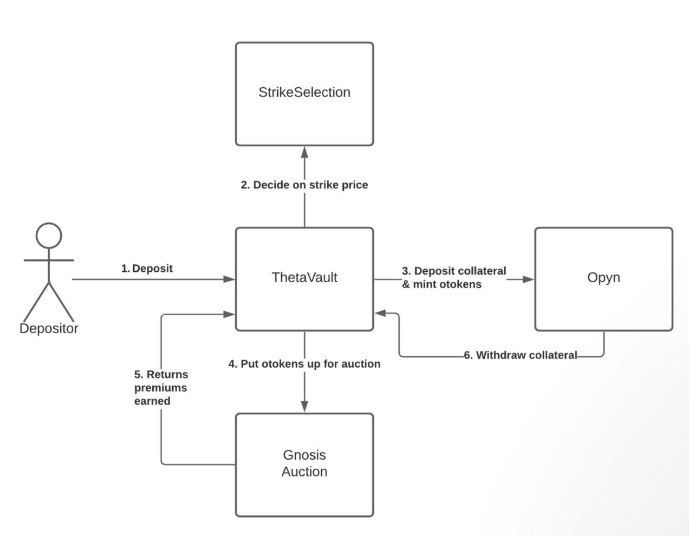
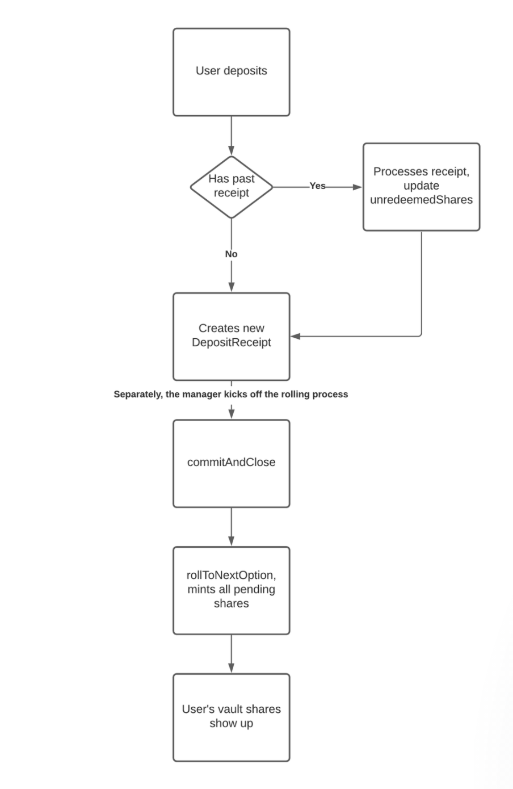
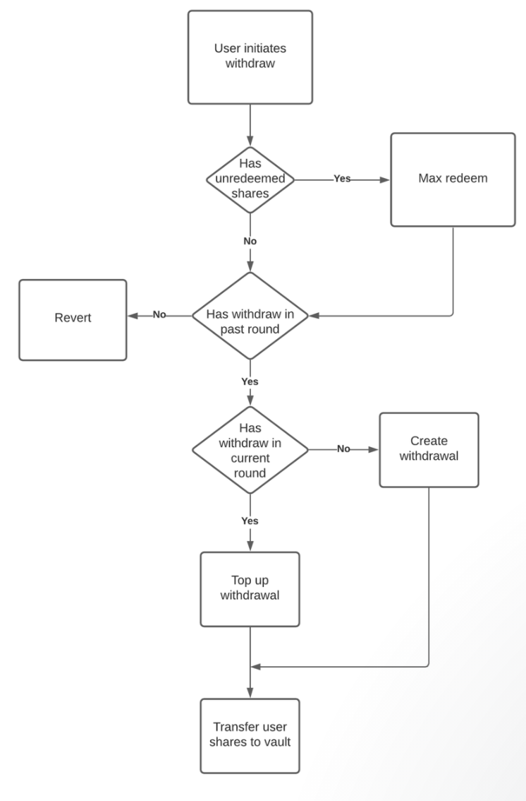
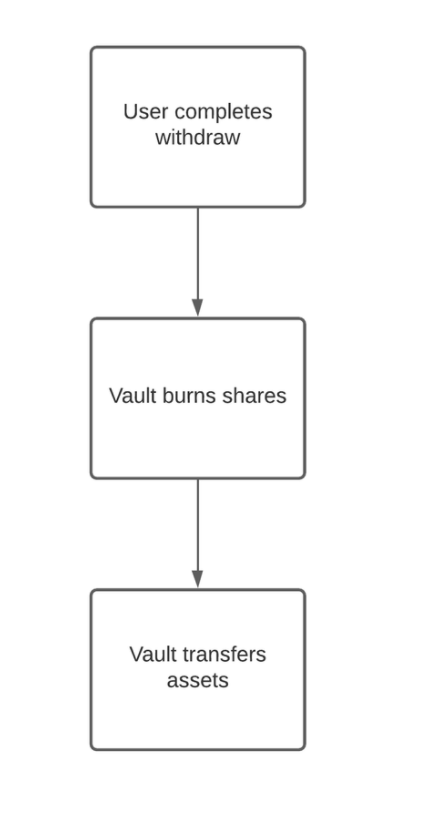
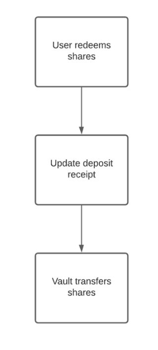

# Ribbon V2

Ribbon v2 is the next version for Ribbon’s Theta Vault product. It brings several major improvements to the vault and makes the vault operations decentralized. 

### V2 changes include <a id="V2-changes-include"></a>

1. Decentralization of Theta Vault operations
2. Improved capital efficiency
3. No more withdrawal fees
4. Meta-Vault strategies

[Paired video](https://www.loom.com/share/be2a76a724ab45769737bd8ffeddadb3)

### Architecture




1. User deposits 100 ETH into Theta Vault \(ETH call\).
2. On Friday 10am UTC, the vault uses 100% of its funds to mint 100 [otokens](https://opyn.gitbook.io/opyn/contracts/otoken), which are ERC20 representations of options contracts. The 100 ETH is locked for a week in Opyn.
3. After receiving the 100 otokens, the vault puts it up for [auction](https://gnosis-auction.eth.link/#/docs/batch-auctions).
   1. Anyone can participate and bid on the otokens. They pay the premiums for the otoken in ETH.
   2. At the end of the auction, the vault collects 1 ETH in premiums in the form of ETH.
   3. Any remaining otokens that are not bought are burned, redeeming 1 otoken for 1 unit of collateral from Opyn.
4. On the next Friday 10am UTC,
   1. If the options expire in the money, the vault withdraws less than 100 ETH from Opyn.
   2. If the options expire out the money, the vault withdraws exactly 100 ETH.
5. Let's say it expires out the money. The vault repeats step 2 with 101 ETH \(original 100 ETH + 1 ETH premium\).

### Architecture / Codebase Walkthrough

| Name | Description |
| :--- | :--- |
| [libraries/Vault.sol](https://github.com/ribbon-finance/ribbon-v2/blob/master/contracts/libraries/Vault.sol) | Contains all data structures shared across all vault types |
| [libraries/VaultLifecycle.sol](https://github.com/ribbon-finance/ribbon-v2/blob/master/contracts/libraries/VaultLifecycle.sol) | Contains all logic related to how the Vault functions on a weekly basis |
| [vaults/BaseVaults/base/RibbonVault.sol](https://github.com/ribbon-finance/ribbon-v2/blob/master/contracts/vaults/BaseVaults/base/RibbonVault.sol) | Contains all common logic like accounting and options rolling shared across RibbonThetaVault and RibbonDeltaVault. |
| [vaults/BaseVaults/RibbonThetaVault.sol](https://github.com/ribbon-finance/ribbon-v2/blob/master/contracts/vaults/BaseVaults/RibbonThetaVault.sol) | Theta Vault contract that creates short options position with Opyn on a weekly basis |
| [utils/StrikeSelection.sol](https://github.com/ribbon-finance/ribbon-v2/blob/master/contracts/utils/StrikeSelection.sol) | Periphery contract used to calculate the best strike price for the Theta Vault to choose for the week, given a few parameters |

#### Deposit Flow




1. The user deposits 1 ETH into TV.
2. We first check if they have an existing `DepositReceipt` from the past `round`. Using the `round` and `amount`, we update the `unredeemedShares` field. This essentially tracks how many shares the user owns, but has not yet redeemed.

```text
struct DepositReceipt {
	round
	amount
	unredeemedShares
}
```

1. We create the DepositReceipt with the new details.
2. At `rollToNextOption`, the vault will mint all the shares that are owed to users to `address(this)`. This increments the `vaultState.round`.
3. Since the round is concluded, the user's vault shares should show up by calling `RibbonVault.shares(account)`

The end result:

* Their shares show up automatically once the round concludes.
* `DepositReceipt`s are used to track all the user's unredeemed shares. This is used for withdrawals and redemptions in the future.

#### Withdrawal Flow

The withdrawal flow is slightly more involved. We have two types of withdrawals - Standard and Instant withdrawals.

**Standard withdrawals**

* Withdrawals are created with the `initiateWithdraw` function, which queues the shares to be burned.
* Withdrawals are completed with `completeWithdraw` function, which burns the shares, and returns the assets.
* Users can only call `completeWithdraw` only AFTER the week's Friday 10am UTC. For example, the user calls `initiateWithdraw` on Wednesday. They can only complete the withdrawal after the same week's Friday 10am UTC.
* Withdrawals stack on top of each other. This means that if I do `initiateWithdraw(10)`, and I do `initiateWithdraw(20)` again, I will have a total withdrawal of 30 shares by Friday.





**Instant withdrawals**

* Instant withdrawals are only accessible to funds that are deposited mid-week.
* For example, user deposits 10 ETH into TV on Wednesday. They can call `withdrawInstantly` to return up to 10 ETH, from Wednesday till Friday.

#### Share Redemption Flow

Share redemption is a "pro" feature catered to power-users and protocols that want to integrate with Ribbon.

As mentioned before, when the user deposits into the vault, the vault mints and holds custody of the user's shares on `address(this)`. This is not ideal for protocols or Meta-Vaults that want to hold custody of their shares. By calling the `redeem` or `maxRedeem` function, contracts are able to take custody of their vault shares.

The share redemption flow is also triggered implicitly when users call `initiateWithdraw`.



#### Access Control

<table>
  <thead>
    <tr>
      <th style="text-align:left">Name</th>
      <th style="text-align:left">Privileges</th>
    </tr>
  </thead>
  <tbody>
    <tr>
      <td style="text-align:left">Owner</td>
      <td style="text-align:left">
        <p>The owner can set key parameters of the vault such as feeRecipient, performanceFee,
          managementFee, deposit cap etc.</p>
        <p>Some functions in the vault&apos;s lifecycle is only limited to the owner,
          such as commitAndClose and rollToNextOption.</p>
      </td>
    </tr>
    <tr>
      <td style="text-align:left">Admin</td>
      <td style="text-align:left">The admin can upgrade the proxy&apos;s implementation address.</td>
    </tr>
  </tbody>
</table>

Both of these privileged roles use a Gnosis Safe multisig wallet.

