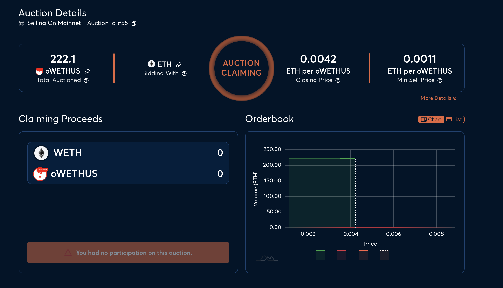

# Participating in Open Auctions

## Overview

* Open Auctions are a batch auction conducted on the Gnosis Auction platform to sell off options that are minted by Theta Vault.
* A batch auction means that there is **only one clearing price**.
* Using an auction allows for price discovery on-chain, to ensure the options sale process is decentralized.

## Video Guides

Placing a bid on the auction



Claiming OTokens from Auction



## Auction Process Flow

To run through how Theta Vaults would function, we use ETH Call Theta Vault as an example.

1. ETH Call Theta Vault holds 100 ETH from depositors. It rolls the 100 ETH into Opyn and mints 100 call options with $4000 strike, expiring next Friday.
2. The vault starts the option auction. The vault deposits 100 call options onto the auction, and specifies the minimum price of an option. \(Premiums are denominated in underlying for calls, USDC for puts\)
3. Auction participants participate in the auction by placing bids on-chain. They can place multiple bids and also cancel bids. Each bid consumes gas.
4. Auction is concluded in one hour. The vault withdraws the premiums and earns yield for the week.
5. If there are unsold options from the auctions, the vault withdraws the options and burns them.
6. Auction participants get to claim their options from the auction. If the bid is not filled, the auction participant will then get a refund of their bid amount.

## Auction Schedule

Friday 8am UTC - Previous week's options expire. Settlement price is set.

Friday 10.15am UTC - Strike price selected.

Friday 11.15am UTC - Auction commenced.

Friday 11.45am UTC - No bids can be cancelled anymore.

Friday 12.15pm UTC - Auction concludes.

## Batch Auction Summary

To read the detailed doc about how Batch Auctions work, [please read this documentation by Gnosis](https://gnosis-auction.eth.link/#/docs/batch-auctions). This is only a summary of how the pricing mechanism works.

1. Auction participants place their bids for the option.
2. The auction is concluded, no new bids are accepted and no orders can be cancelled.
3. The bids are sorted from the highest to the lowest bid.
4. Going through the bids from the highest price, the amount of options sold will be counted.
5. When the target sell volume is hit, the final price will settle at the last volume.

**Summary:** Everyone gets a single clearing price. However, bidding a high price increases our chance of being filled. Bidding low could result in not have their orders filled.

## Strategies for Executing a Buy

* Since the auctions will run the full course of an hour, it is not great for market makers who instantly hedge the other side by buying options.
* One way around this is to place a bid close to the end of the auction \(Friday 12.15pm UTC\). That way we learn if we are filled instantly.
* By bidding at the end, it also gives us a high certainty of being filled. We can just bid higher than what we think the final price would settle at.

## Auction User Interface Guide

A detailed rundown of how to use the Gnosis Auction interface can be [found here](https://gnosis-auction.eth.link/#/docs/participate-as-a-bidder).

## Optimizing for Gas

There are 2 Ethereum transactions that have to land on-chain to participate in the auction:

1. Placing an order
2. Claiming the order

For claiming an order, when the order is not filled, you will get a refund of the collateral you locked into the order. On the other hand, if it is filled, you will get the otokens auctioned.

In order to save on gas fees, one strategy would be to:

* Only claim when orders are refunded.
* Avoid claiming the otokens until expiry. Since the otokens will be worthless if they expire out-the money, we can wait until after the expiry to decide if we want to claim them or not.
* If the otokens are out-the-money, we can avoid claiming the otokens entirely as it will incur gas costs.

