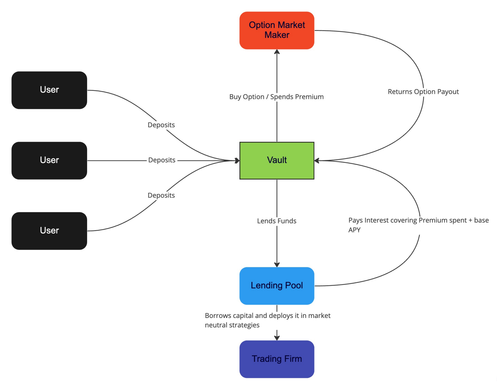

# Series V - Volatility Strangles

### What are Strangles?

A [strangle](https://en.wikipedia.org/wiki/Strangle_%28options%29) is an options strategy in which the investor holds a call and a put position at different strike prices. A strangle is a good strategy if you think the underlying asset will experience a large price movement in the near future, but are unsure of the direction.

### How are Strangle contracts priced?

Each Strangle contract will have 1 underlying call option and 1 underlying put option. The total cost of 1 contract is the sum of the call option’s premium and the put option’s premium on the underlying venues \(Hegic or Opyn\).

### Where do Strangle contracts trade?

Currently Strangle contracts are only traded on Ribbon. We do not tokenize the Strangle positions yet, so they are not tradable on a secondary exchange such as Uniswap.

### How do I know I am getting the best price for a Strangle?

Ribbon finds the cheapest price for each option on-chain, for the position size that you are trying to trade. Before you checkout, the Ribbon UI will show you the prices of the underlying call and put options.

### How can I exercise my Strangle positions?

You can access and exercise your positions at the Positions page. Generally positions that have call or put options which are in-the-money can be exercised. Due to the differences in how the underlying options protocols work, some positions can only be exercised after expiry, whereas others can be exercised only before the expiry.  

