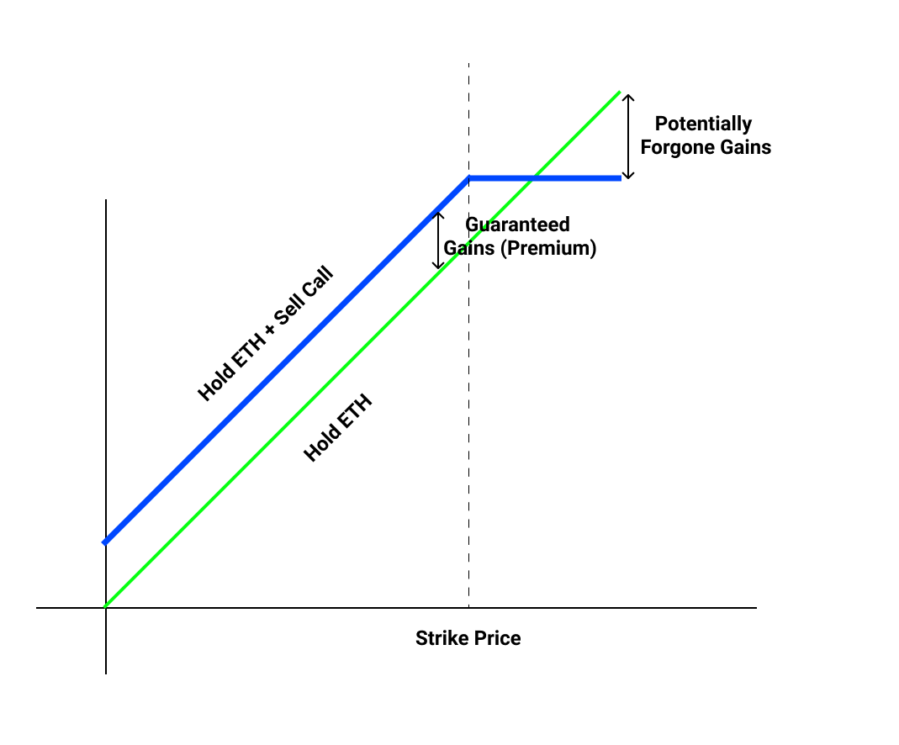

# Series Y - Theta Vaults

Series Y is a series of structured products that are focused on yield-enhancing strategies for assets such as ETH and BTC.

The first Theta Vault will run a [covered call](https://www.investopedia.com/terms/c/coveredcall.asp) strategy, which earns yield on a weekly basis through writing out of the money covered calls and collecting the premiums.

## What is a Covered Call strategy?

The covered call strategy is a unique options strategy where you earn yield for selling _potential upside_ of an asset. For example, if you are willing to give up potential upside of ETH going above $25k by the end of the year, you can get paid 2% in yield for selling a $25k call option. This is over 10x the yield you can earn by supplying ETH on Compound.

In the unlikely case that ETH goes to $30k, you would have given up $5k, but you are still tremendously up in USD terms — it is a win-win scenario for you because you only risk getting exercised when ETH absolutely moons.

## Strike Selection and Expiry 

To further reduce the risk of our options getting exercised, we can sell call options that expire sooner rather than later, because of how difficult it is to predict how ETH could perform over a longer time frame. Our initial vaults will sell _weekly_ call options, meaning we can adjust our expectation of ETH’s price on a weekly basis. This also has the nice side effect of letting us compound our premiums more frequently.

Secondly, we need to select strike prices that are far enough from today’s spot price to reduce the risk of exercise. Our current methodology for strike selection and backtests show that we only get exercised less than 5% of the time from Jan 2020 to today, even throughout the entire run up of ETH from $80 to $2000. We will publish a follow-up blog post about our strike selection methodology in detail.

