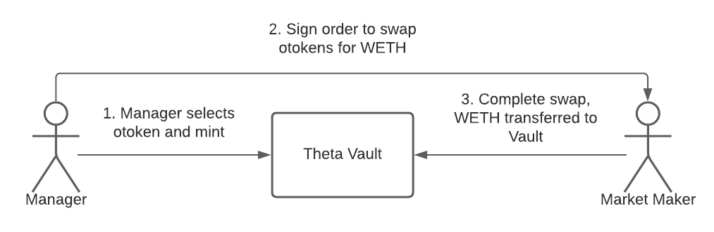

# Introduction to Theta Vault

Theta Vault runs are vaults that run an automated options selling strategy, which earns yield on a weekly basis through writing out of the money options and collecting the premiums.

## What are Theta Vaults?

Theta Vaults use the Vault terminology because it stems from the idea of depositing your assets into a vault and earning a yield on them, set-and-forget.

Users can simply deposit their assets into a smart contract and will automatically start running a specific options strategy. This alleviates a majority of the gas problems by socializing the gas costs across all the vault depositors. Instead of doing 3–4 transactions per week per user, the vault will do 3–4 transactions per week for thousands of users at once. This makes the user experience of using these Theta Vaults extremely straightforward and relatively cheap — deposit, wait for yields, and withdraw.

## What is a Covered Call strategy?

The covered call strategy is a unique options strategy where you earn yield for selling _potential upside_ of an asset. For example, if you are willing to give up potential upside of ETH going above $25k by the end of the year, you can get paid 2% in yield for selling a $25k call option. This is over 10x the yield you can earn by supplying ETH on Compound.

In the unlikely case that ETH goes to $30k, you would have given up $5k, but you are still tremendously up in USD terms — it is a win-win scenario for you because you only risk getting exercised when ETH absolutely moons.

## Strike Selection and Expiry 

To further reduce the risk of our options getting exercised, we can sell call options that expire sooner rather than later, because of how difficult it is to predict how ETH could perform over a longer time frame. Our initial vaults will sell _weekly_ call options, meaning we can adjust our expectation of ETH’s price on a weekly basis. This also has the nice side effect of letting us compound our premiums more frequently.

Secondly, we need to select strike prices that are far enough from today’s spot price to reduce the risk of exercise. Our current methodology for strike selection and backtests show that we only get exercised less than 5% of the time from Jan 2020 to today, even throughout the entire run up of ETH from $80 to $2000.&#x20;

## Technical Architecture

Theta Vaults in its present design relies on [Opyn](https://opyn.co) oTokens. oTokens are ERC20 token representations of an options contract, where each of them have a strike price and expiry. Owning oTokens is functionally equivalent to owning an options contract. This gives the oToken holder the right to redeem some amount of the underlying asset if the strike price is hit.

In order to run an options-writing strategy, the Vault needs to be able to mint and short oTokens. The Vault uses the users’ deposited funds to lock collateral into Opyn + mint oTokens, then sells them for a premium. The Vault’s collateral will be locked until the expiry of the oToken. This collateral is used to pay off oToken holders in the case that the options expire in the money.

To facilitate the week-by-week operations of Theta Vaults, there is a privileged role called the Manager. The Manager is responsible for:

1. Selecting the parameters of the oToken to mint i.e. strike price and expiry.
2. Signing oToken sales OTC on behalf of the Theta Vault

In collaboration with option market makers, below is a diagram of how an options sale is conducted:

1. Theta Vault mints oTokens\
   ****a) The manager selects an oToken to mint based on the parameters of strike price and expiry.\
   b) Vault uses deposited funds to lock collateral into Opyn protocol\
   c) Vault mints oToken and holds onto these oTokens
2. Initiating oToken trade\
   a) Manager and market makers decide on a price to sell the oTokens for (off-chain)\
   b) Manager signs an Airswap order that exchanges the oTokens for WETH on behalf of the Theta Vault\
   b) Manager sends the signed order to a market maker (off-chain)
3. Completing oToken trade\
   a) Market maker counter-signs the order and posts the trade on the blockchain\
   b) The swap is completed, Vault receives premium in WETH whereas the market maker receives the oTokens

The net result of this process is that the Vaults should receive premiums in return for writing the oTokens. This will mean that the Vault’s balance will expand over time as premiums are collected and compounded.

## Oracles

Ribbon mints options using [Opyn](https://www.opyn.co) and hence inherits Opyn's oracle system for settling the options. Currently, Opyn uses [Chainlink](https://opyn.gitbook.io/opyn/#how-does-auto-exercise-work) as the oracle provider for settling the options.&#x20;

By using Chainlink instead of other on-chain oracles, Ribbon users are not susceptible to flashloan attacks that manipulate the price of an asset. &#x20;

