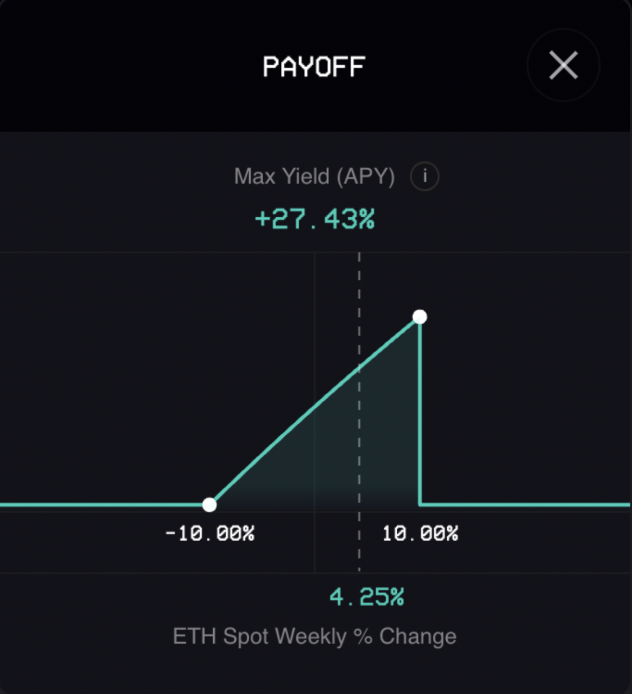

# What is a dolphin strategy?

The vault earns a base APY from Lido and uses the remaining funding, plus the 0.5% of its deposits, to purchase weekly at-the-money knock-out barrier options.&#x20;

The weekly [barrier options](https://www.investopedia.com/terms/b/barrieroption.asp) enable the vault to participate in any ETH upside from 90% up to 110% of the ETH's spot level at the start of the week (upside barrier). However, if the price of ETH has increased by more than 10% at the end of the week, the barrier options expire worthless and the vault earns the base APY only.

<figure><figcaption></figcaption></figure>
